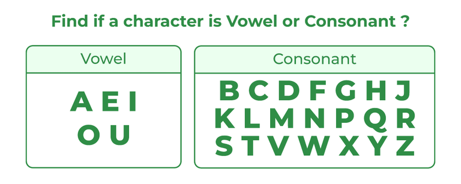
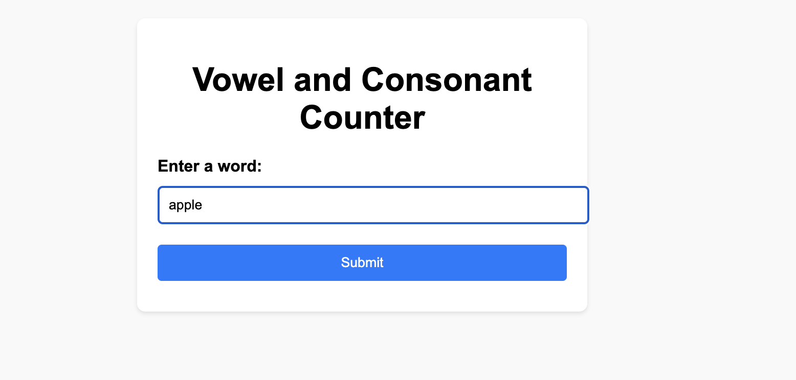
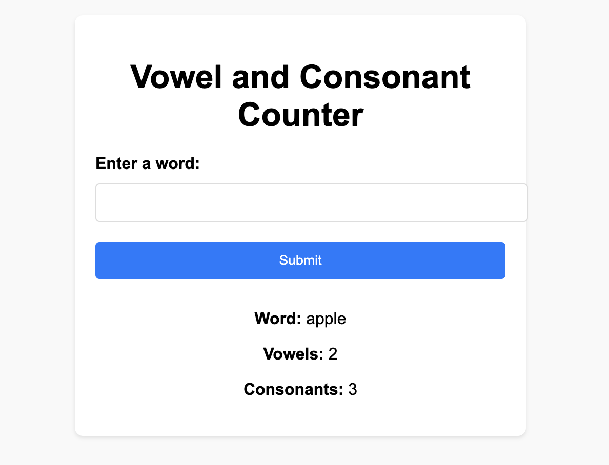

# Mini Project #12: Vowel and Consonant Counter Application

[](https://github.com/nogibjj/Eric_Ortega_Rodriguez_Mini_Project_6/actions/workflows/cicd.yml)

<div align="center">
    
</div>

### Author: Eric Ortega Rodriguez

---

## Overview

This project is a **simple yet powerful Python web application** developed with the Flask framework. Its primary function is to count the number of vowels and consonants in a word entered through a web form.

In addition to the core functionality, the application demonstrates:
- **Containerization** using Docker for seamless deployment.
- **Integration into a CI/CD pipeline** to automate building, testing, and deploying the app.
- **Publishing Docker images to Docker Hub** for enhanced portability.

This project showcases modern application development practices, making it an excellent demonstration of scalable and portable Python-based web applications.

---

## Features

- **Interactive Web-based UI**:
  - Submit a word through an intuitive web form.
  - Instantly view the count of vowels and consonants in the entered word.

- **Lightweight and Containerized**:
  - Simplified deployment with Docker.
  - Includes a well-structured `Dockerfile` for building reproducible images.

- **Robust CI/CD Integration**:
  - Automates the building, testing, and deployment process.
  - Publishes Docker images to Docker Hub for effortless sharing.

---

## How It Works

1. **Input**: Users submit a word via the web interface.
2. **Processing**: The application calculates the number of vowels and consonants in the input.
3. **Output**: Results are displayed on the same page in a clean and user-friendly format.

### Example Workflow

#### Step 1: Input a Word
<div align="center">
    
</div>

#### Step 2: View the Output
<div align="center">
    
</div>

- **Input**: `Flask`
- **Output**:
  - Vowels: `1`
  - Consonants: `4`

---

## Usage

### Running Locally

#### Prerequisites:
- Python 3.9 or higher.
- Install dependencies listed in `requirements.txt`.

#### Steps:
1. Clone the repository:
   ```bash
   git clone <repository-url>
   cd <repository-directory>
